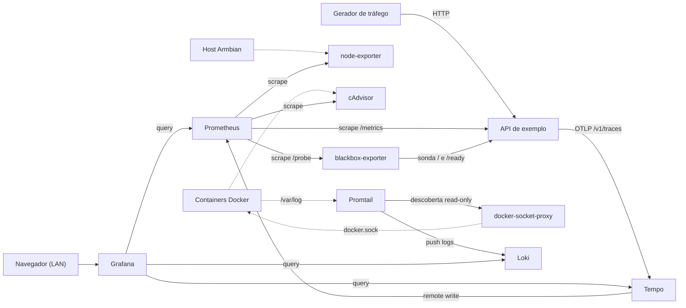

# Homelab Observability Box

Projeto de home lab para transformar uma TV box Amlogic S905X3, Raspberry Pi ou outro hardware ARM64 em uma box de observabilidade com Grafana, Prometheus, Loki, Tempo, node-exporter, cAdvisor, blackbox-exporter e Promtail.

A diferença para um setup de produção: aqui **tudo roda e fica acessível na própria rede local**. Não há Cloudflare, túneis nem domínios públicos. A própria stack já inclui uma **API de exemplo** (Node.js + Express + TypeScript) e um **gerador de tráfego**, então você vê dados reais no Grafana — métricas, logs e traces — em minutos, sem precisar conectar nenhum serviço externo.

O objetivo é partir de um dispositivo limpo, instalar Armbian, subir a stack com Docker Compose e explorar os três pilares da observabilidade num ambiente fechado.

## O que esta stack entrega

- API de exemplo instrumentada, com métricas Prometheus (`prom-client`), logs JSON estruturados e traces OpenTelemetry.
- Gerador de tráfego que chama a API continuamente, simulando latência variável e erros.
- Grafana provisionado com datasources, dashboards e alertas.
- Prometheus coletando métricas da API, métricas da própria box e sondas HTTP.
- Loki para logs locais do sistema e de todos os containers da box (incluindo a API).
- Tempo recebendo traces OpenTelemetry via OTLP HTTP/gRPC.
- Metrics-generator do Tempo habilitado para span metrics, service graphs e TraceQL metrics.

## Topologia

Setas sólidas indicam quem **inicia** a conexão de rede (o rótulo diz o quê); setas pontilhadas indicam **leitura local** (host, containers ou socket do Docker).



## Hardware recomendado

Este projeto foi validado em uma TV box T95 Max Plus com:

- SoC: Amlogic S905X3.
- CPU: 4x Cortex-A55.
- RAM: 4 GB físicos, aparecendo como aproximadamente 3,2 GiB utilizáveis no Linux.
- Armazenamento externo: microSD SanDisk Extreme Plus de 128 GB.
- Armazenamento interno: eMMC de 32 GB, aparecendo como ~29 GB no Linux.
- Sistema: Armbian OS 26.05.0 resolute, kernel 6.12.91-ophub.

Recomendação prática:

- Mínimo funcional: 2 GB RAM e microSD de 32 GB, com pouca retenção e menos folga. Compilar a imagem da API na box é mais pesado com 2 GB; veja a nota na seção de subida.
- Recomendado: 4 GB RAM e microSD de 64 GB.
- Melhor para home lab: 4 GB RAM e microSD de 128 GB, especialmente se quiser manter Prometheus, Loki e Tempo por mais tempo.
- Use uma fonte de energia estável. Em TV boxes, fonte ruim costuma causar travamentos e corrupção do SD.
- Prefira cartão SD de qualidade, classe A2/U3 ou superior. SD barato em TV box é a causa mais comum de corrupção de dados e instabilidade silenciosa.
- Prefira Ethernet. Wi-Fi de TV box barata costuma ser inconsistente no Linux.

## Sistema operacional

A box validada está rodando uma imagem OPHUB para Amlogic S905X3:

- Release: [Armbian_resolute_arm64_server_2026.05](https://github.com/ophub/amlogic-s9xxx-armbian/releases/tag/Armbian_resolute_arm64_server_2026.05)
- Imagem S905X3/kernel 6.12.91: [Armbian_26.05.0_amlogic_s905x3_resolute_6.12.91_server_2026.05.31.img.gz](https://github.com/ophub/amlogic-s9xxx-armbian/releases/download/Armbian_resolute_arm64_server_2026.05/Armbian_26.05.0_amlogic_s905x3_resolute_6.12.91_server_2026.05.31.img.gz)
- Projeto upstream: [ophub/amlogic-s9xxx-armbian](https://github.com/ophub/amlogic-s9xxx-armbian)
- Página Armbian para S905X3: [armbian.com/soc/s905x3](https://www.armbian.com/soc/s905x3/)

Observação: TV boxes Amlogic não são placas padronizadas como Raspberry Pi. Mesmo com o mesmo SoC, algumas variantes precisam de outra imagem ou outro DTB. Se a imagem `amlogic_s905x3` não bootar na sua T95 Max Plus, teste a variante `s905x3-x88-pro-x3` da mesma release ou consulte a tabela de dispositivos do OPHUB.

Não instale no eMMC no primeiro dia. Primeiro valide boot, rede, Docker, temperatura, estabilidade e a stack inteira rodando pelo microSD.

## Gravar a imagem no microSD

Baixe o arquivo `.img.gz` da imagem escolhida. Não precisa descompactar se usar Raspberry Pi Imager ou balenaEtcher.

### macOS

Opções gráficas: [Raspberry Pi Imager](https://www.raspberrypi.com/software/) ou [balenaEtcher](https://etcher.balena.io/).

Opção por terminal:

```bash
diskutil list
diskutil unmountDisk /dev/diskN
gzip -dc Armbian_26.05.0_amlogic_s905x3_resolute_6.12.91_server_2026.05.31.img.gz | sudo dd of=/dev/rdiskN bs=4m status=progress conv=sync
diskutil eject /dev/diskN
```

Substitua `diskN` pelo disco do microSD. Usar o disco errado apaga outro dispositivo.

### Linux

Opções gráficas: Raspberry Pi Imager ou balenaEtcher.

Opção por terminal:

```bash
lsblk
gzip -dc Armbian_26.05.0_amlogic_s905x3_resolute_6.12.91_server_2026.05.31.img.gz | sudo dd of=/dev/sdX bs=4M status=progress conv=fsync
sync
```

Substitua `/dev/sdX` pelo dispositivo inteiro do microSD, não por uma partição como `/dev/sdX1`.

### Windows

Use Raspberry Pi Imager ou balenaEtcher. Rufus também funciona, mas exige descompactar o `.gz` antes com 7-Zip. Depois de gravar, ejete o cartão com segurança.

## Boot pela SD na T95 Max Plus

A T95 Max Plus normalmente não dá boot automaticamente pelo microSD no primeiro uso. Em boxes Amlogic, o boot inicial pela SD costuma ser ativado pelo método "toothpick": segurar o botão de reset enquanto liga a fonte.

Na T95 Max Plus, o botão de reset fica escondido dentro da porta AV. Você pressiona esse botão com um palito, clipe ou ferramenta fina. Pressione com cuidado: deve haver um pequeno clique mecânico. Não force a lateral do conector.

### Método principal: toothpick

1. Grave o microSD com a imagem Armbian.
2. Desligue a TV box da tomada.
3. Insira o microSD no slot TF/microSD.
4. Conecte cabo Ethernet.
5. Opcional, mas recomendado no primeiro boot: conecte HDMI para ver logo, boot log ou tela do Armbian.
6. Insira um palito ou clipe na porta AV até sentir o botão de reset.
7. Mantenha o botão pressionado.
8. Com o botão ainda pressionado, conecte a fonte de energia.
9. Continue segurando por 8 a 15 segundos.
10. Solte quando perceber mudança de tela, logo de boot, pinguins do Linux, LED piscando diferente ou atividade de rede.
11. Aguarde alguns minutos. O primeiro boot pode ser lento porque o sistema expande o filesystem, inicializa serviços e prepara o usuário.

Depois que o ambiente de boot da Amlogic é ajustado, muitas boxes passam a tentar boot pela SD nos próximos boots sem repetir o toothpick. Se remover o SD ou a box voltar para Android, repita o método.

### Se ela iniciar no Android

1. Desligue da tomada e repita o toothpick.
2. Teste outro microSD, preferencialmente de marca boa.
3. Regrave a imagem, porque gravação parcialmente corrompida é uma causa comum.
4. Teste a variante `s905x3-x88-pro-x3` da mesma release.
5. Se o Android tiver app de update/recovery, tente reiniciar para recovery com o microSD inserido.
6. Se tiver ADB habilitado, tente `adb reboot update` ou `adb reboot recovery`.

### Se não houver imagem no HDMI

Para este projeto, HDMI não é obrigatório. A box pode estar bootando corretamente mesmo sem vídeo útil. Confira no roteador se apareceu um novo cliente DHCP e tente SSH:

```bash
ssh root@BOX_IP
```

Também dá para procurar pela rede local:

```bash
arp -a
nmap -p 22 192.168.1.0/24
```

O IP acima é exemplo. Ajuste para a sua rede.

### Se a SD não bootar de jeito nenhum

- Troque a fonte de energia.
- Troque o microSD.
- Regrave a imagem com balenaEtcher ou Raspberry Pi Imager.
- Use Ethernet, não Wi-Fi.
- Teste boot por pendrive na porta USB 3.0, se a sua variante permitir.
- Teste outra imagem S905X3 da mesma release OPHUB.
- Consulte o fórum Armbian/OPHUB para o modelo exato da placa, porque "T95 Max Plus" pode aparecer com revisões internas diferentes.

## Primeiro acesso ao Armbian

O login inicial das imagens OPHUB costuma ser:

```text
usuário: root
senha: 1234
porta SSH: 22
```

Conecte:

```bash
ssh root@BOX_IP
```

Troque a senha quando solicitado. Depois rode a configuração básica:

```bash
hostnamectl set-hostname homelab-box
timedatectl set-timezone America/Sao_Paulo
apt update
apt full-upgrade -y
reboot
```

Reconecte depois do reboot e confira o ambiente:

```bash
ssh root@BOX_IP
cat /etc/os-release
uname -a
free -h
df -h /
```

## Backup e instalação opcional no eMMC

Rodar pelo microSD é o caminho mais seguro para este projeto. A instalação no eMMC é opcional e só faz sentido se você quiser deixar a box independente do cartão. Em TV boxes isso tem risco real: o processo apaga o sistema interno atual (normalmente Android) e uma escolha errada de imagem/DTB pode fazer a box parar de bootar sem recuperação por SD/USB.

Antes de instalar no eMMC:

- Valide que o Armbian boota pela SD de forma repetível.
- Valide Ethernet, SSH, Docker e temperatura.
- Faça backup do eMMC original e copie-o para outro computador ou disco.
- Aceite que o eMMC interno pode ser menor que o microSD. Na T95 Max Plus validada, o eMMC aparece com cerca de 29 GB.

### Identificar SD e eMMC

Com a box bootada pelo microSD, rode:

```bash
lsblk -o NAME,SIZE,TYPE,FSTYPE,MOUNTPOINTS,MODEL
findmnt -no SOURCE /
findmnt -no SOURCE /boot
```

Na T95 Max Plus validada: `/dev/mmcblk1` é o microSD (`p1` = `/boot`, `p2` = `/`) e `/dev/mmcblk2` é o eMMC interno. Não assuma que será igual em toda placa. Confirme pelo tamanho dos discos e pelos mountpoints.

### Fazer backup do eMMC original

O OPHUB inclui o utilitário `armbian-ddbr` para backup e restore do eMMC. Rode pela sessão SSH, com a box bootada pela SD:

```bash
armbian-ddbr
```

No menu, escolha `b` (backup). O backup do sistema atual do eMMC vai para o armazenamento externo de onde o Armbian está rodando, normalmente em:

```text
/ddbr/BACKUP-arm-64-emmc.img.gz
```

Confira e copie o backup para fora da box antes de prosseguir:

```bash
ls -lh /ddbr/
gzip -t /ddbr/BACKUP-arm-64-emmc.img.gz
BOX_IP=192.168.1.50
scp root@$BOX_IP:/ddbr/BACKUP-arm-64-emmc.img.gz ./BACKUP-arm-64-emmc.img.gz
```

Guarde esse arquivo fora da box. Se o microSD falhar ou for regravado, um backup deixado apenas em `/ddbr` pode ser perdido.

### Instalar Armbian no eMMC

Só continue se o backup já foi feito, testado com `gzip -t` e copiado para fora da box. Com a box ainda bootada pela SD:

```bash
armbian-install
```

O instalador é interativo. Em imagens OPHUB para Amlogic, ele detecta o eMMC e copia o sistema atual da SD para o armazenamento interno. Quando perguntado sobre o destino, selecione o eMMC interno, não o microSD. Na T95 Max Plus validada, o eMMC aparece como `/dev/mmcblk2`.

Ao terminar, rode `poweroff`, desligue a fonte, remova o microSD, ligue a box de novo e deixe-a bootar pelo eMMC. Descubra o IP no roteador (se mudou), conecte por SSH e valide:

```bash
findmnt -no SOURCE /
lsblk -o NAME,SIZE,TYPE,FSTYPE,MOUNTPOINTS
```

Agora `/` deve estar no eMMC, normalmente em algo como `/dev/mmcblk2p2`.

### Restaurar o backup original do eMMC

Boote novamente pelo microSD, copie o backup de volta e rode o restore:

```bash
BOX_IP=192.168.1.50
scp ./BACKUP-arm-64-emmc.img.gz root@$BOX_IP:/ddbr/BACKUP-arm-64-emmc.img.gz
```

Na box:

```bash
gzip -t /ddbr/BACKUP-arm-64-emmc.img.gz
armbian-ddbr   # escolha "r" (restore)
```

Ao final, desligue, remova o SD e ligue novamente para testar o sistema restaurado.

## Instalar Docker Engine

O Armbian usado aqui é baseado em Ubuntu ARM64. A forma mais limpa é usar o repositório oficial do Docker para Ubuntu. Execute na box:

```bash
apt remove -y docker.io docker-compose docker-compose-v2 docker-doc podman-docker containerd runc || true
apt update
apt install -y ca-certificates curl
install -m 0755 -d /etc/apt/keyrings
curl -fsSL https://download.docker.com/linux/ubuntu/gpg -o /etc/apt/keyrings/docker.asc
chmod a+r /etc/apt/keyrings/docker.asc

cat >/etc/apt/sources.list.d/docker.sources <<EOF
Types: deb
URIs: https://download.docker.com/linux/ubuntu
Suites: $(. /etc/os-release && echo "${UBUNTU_CODENAME:-$VERSION_CODENAME}")
Components: stable
Architectures: $(dpkg --print-architecture)
Signed-By: /etc/apt/keyrings/docker.asc
EOF

apt update
apt install -y docker-ce docker-ce-cli containerd.io docker-buildx-plugin docker-compose-plugin
systemctl enable --now docker
docker run --rm hello-world
docker compose version
```

Referência: [Docker Engine on Ubuntu](https://docs.docker.com/engine/install/ubuntu/).

## Clonar o projeto na box

Clonar o repositório diretamente na box evita cópia manual de arquivos e facilita atualizações. Instale o Git, se necessário, e clone no diretório recomendado `/opt/homelab-observability`:

```bash
apt update && apt install -y git
git clone https://github.com/SEU_USUARIO/homelab-observability-box.git /opt/homelab-observability
cd /opt/homelab-observability
```

> **Nota:** Ajuste a URL para o seu repositório.

## Configurar o arquivo de ambiente

A stack lê suas configurações de um arquivo `.env`. Os valores padrão já funcionam para um ambiente local; copie o exemplo e ajuste o que quiser:

```bash
cp .env.example .env
```

Conteúdo do `.env`:

```dotenv
# Credenciais do admin do Grafana
GRAFANA_ADMIN_USER=admin
GRAFANA_ADMIN_PASSWORD=admin

# Nome do serviço reportado nos traces (Tempo)
OTEL_SERVICE_NAME=homelab-api

# Taxa de erros simulados na API (0.0 a 1.0)
ERROR_RATE=0.05

# Intervalo entre requisições do gerador, em ms (500 = 2 req/s)
REQUEST_INTERVAL_MS=500
```

Troque `GRAFANA_ADMIN_PASSWORD` antes de expor a box na sua LAN. Ao contrário de um setup de produção, aqui não há tokens nem segredos de nuvem: o `.env` guarda apenas preferências locais.

## Subir a stack na box

A imagem da API e do gerador são construídas localmente, na própria box (ARM64), a partir do código deste repo. Por isso a primeira subida usa `--build`:

```bash
cd /opt/homelab-observability
docker compose up -d --build
```

> **Nota para boxes com 2 GB de RAM:** compilar a API TypeScript e instalar as dependências do OpenTelemetry consome memória e pode levar alguns minutos no primeiro build. Se o build for morto por falta de memória (`Killed`), crie um swap temporário com `fallocate -l 2G /swapfile && chmod 600 /swapfile && mkswap /swapfile && swapon /swapfile` antes de repetir.

Acompanhe a subida:

```bash
docker compose ps
docker compose logs -f api generator
```

Em poucos segundos o gerador começa a chamar a API (2 req/s por padrão), e os dados passam a fluir para Prometheus, Loki e Tempo automaticamente.

## Acessar Grafana e Prometheus

O `docker-compose.yml` publica Grafana e a API em todas as interfaces (`0.0.0.0`), para você abrir direto do navegador na LAN. O Prometheus fica em loopback (`127.0.0.1`) porque não tem autenticação.

Acesso direto pela LAN, trocando `BOX_IP` pelo IP da box:

| Serviço        | URL                                              |
| -------------- | ------------------------------------------------ |
| Grafana        | `http://BOX_IP:3000` (login `admin` / sua senha) |
| API de exemplo | `http://BOX_IP:3001`                             |

Para o Prometheus, ou para acessar tudo de forma mais fechada, use um SSH tunnel a partir da sua máquina:

```bash
ssh -L 3000:127.0.0.1:3000 -L 9090:127.0.0.1:9090 root@BOX_IP
```

Com o tunnel aberto, use `http://localhost:3000` (Grafana) e `http://localhost:9090` (Prometheus). Veja a seção "Segurança" sobre a diferença entre expor em `0.0.0.0` e manter em loopback.

## Validar Prometheus

Confira a saúde e os alvos:

```bash
docker compose exec prometheus wget -qO- http://localhost:9090/-/ready
```

No `http://localhost:9090/targets` (via SSH tunnel), todos os jobs devem aparecer `UP`: `prometheus`, `node`, `cadvisor`, `api` e as duas sondas `blackbox-http`. Queries úteis no Explore ou na UI do Prometheus:

```promql
up
up{job="api"}
probe_success
rate(http_request_duration_seconds_count[5m])
```

Diferente de um setup que monitora uma API externa, aqui o alvo `api` e as sondas blackbox sobem `UP` imediatamente, porque a API faz parte da própria stack.

## Validar Grafana

Abra o Grafana e confira:

- `Connections` > datasources: Prometheus, Loki e Tempo.
- Folder `Home Lab`: dashboard **API Overview** provisionado, já mostrando throughput, latência p50/p95/p99, erros 5xx e memória do processo Node.
- Folder `Observability Alerts`: regras de alerta avaliando sem erro.
- Explore > Loki: query `{container="api"}` mostra os logs JSON de cada requisição; `{container="generator"}` mostra o que o gerador dispara.
- Explore > Tempo > Search: selecione o serviço `homelab-api` e abra um trace para ver os spans gerados pela auto-instrumentação.

## Validar Tempo e traces

Gere algumas requisições manuais na API (além do tráfego do gerador):

```bash
for i in $(seq 1 10); do curl -s -o /dev/null http://BOX_IP:3001/users; done
```

Na box, confira métricas internas do Tempo e o metrics-generator:

```bash
docker run --rm --network homelab-observability_default curlimages/curl:8.11.1 \
  -sf http://tempo:3200/ready

docker run --rm --network homelab-observability_default curlimages/curl:8.11.1 \
  -sf http://tempo:3200/metrics \
  | grep -E 'tempo_ring_members|tempo_metrics_generator_active_processors|tempo_metrics_generator_spans_received_total'
```

Resultados esperados:

- `tempo_ring_members{name="metrics-generator",state="ACTIVE"} 1`
- `tempo_metrics_generator_active_processors{processor="local-blocks",...} 1`
- `tempo_metrics_generator_active_processors{processor="span-metrics",...} 1`
- `tempo_metrics_generator_active_processors{processor="service-graphs",...} 1`

Valide TraceQL metrics:

```bash
docker run --rm --network homelab-observability_default curlimages/curl:8.11.1 \
  -G -sS \
  --data-urlencode 'q={resource.service.name="homelab-api"} | rate()' \
  --data-urlencode 'since=15m' \
  --data-urlencode 'step=30s' \
  http://tempo:3200/api/metrics/query_range
```

## Validar métricas derivadas de traces

Depois que a API envia traces, o metrics-generator do Tempo escreve métricas no Prometheus:

```promql
traces_spanmetrics_calls_total
traces_spanmetrics_latency_bucket
traces_service_graph_request_total
sum by (service) (traces_spanmetrics_calls_total)
```

Se essas métricas existem, o service graph e o Traces Drilldown do Grafana têm dados para trabalhar.

## Validar alertas

No Grafana, vá em `Alerting` > `Alert rules` e abra o folder `Observability Alerts`. As regras devem avaliar sem erro. Como este é um ambiente local, **não há contact point externo configurado** (sem Telegram, e-mail etc.): os alertas existem para você visualizar o estado no próprio Grafana e estudar como são montados. Para experimentar um disparo real, aumente a taxa de erro e reinicie a API:

```bash
# no .env
ERROR_RATE=0.6
docker compose up -d api
```

Em poucos minutos o alerta `Taxa de erro 5xx alta (> 5%)` entra em `Firing` na tela de alertas. Volte o valor depois.

Alertas provisionados:

- API fora do ar pela sonda blackbox (`/`).
- `/ready` degradado.
- Taxa de 5xx acima de 5%.
- Latência p95 acima de 1s.
- Disco raiz acima de 85%.
- Memória disponível abaixo de 10%.
- Ingestão de traces parada (Tempo sem spans há 15 min).
- Ingestão de logs parada (Loki sem logs do container `api` há 15 min).

Os dois últimos cobrem falhas silenciosas de telemetria, em que a API continua de pé mas para de mandar traces/logs. O alerta de logs observa os logs do container `api` no Loki (`{container="api"}`), o mesmo label usado no Explore.

## A API de exemplo

A API mora em `api/` e expõe rotas que cobrem o que o Grafana precisa para os dashboards. Cada rota simula uma latência variável e uma taxa de erro 5xx, para os gráficos terem movimento:

| Método | Rota                   | Latência   | Taxa de erro            |
| ------ | ---------------------- | ---------- | ----------------------- |
| GET    | `/` `/ready` `/health` | < 15 ms    | 0%                      |
| GET    | `/metrics`             | —          | 0% (formato Prometheus) |
| GET    | `/users`               | 30–100 ms  | ~5%                     |
| GET    | `/users/:id`           | 15–50 ms   | ~2.5%                   |
| POST   | `/users`               | 100–300 ms | ~10%                    |
| GET    | `/products`            | 20–70 ms   | ~2.5%                   |
| GET    | `/products/:id`        | 10–40 ms   | ~2.5%                   |
| GET    | `/orders`              | 80–250 ms  | ~5%                     |
| POST   | `/orders`              | 150–400 ms | ~10%                    |
| GET    | `/search?q=`           | 50–600 ms  | ~5%                     |

Métricas expostas em `/metrics`: o histograma `http_request_duration_seconds` (com labels `method`, `route`, `status_code`) e as métricas padrão do Node via `prom-client` (`process_resident_memory_bytes`, `nodejs_heap_size_used_bytes`, `nodejs_eventloop_lag_p99_seconds`, entre outras).

### Ajustar o tráfego gerado

O gerador (`generator/`) sobe junto com a stack. Para mudar a intensidade ou a taxa de erro, edite o `.env` e recrie os containers:

```dotenv
REQUEST_INTERVAL_MS=200   # 5 req/s
ERROR_RATE=0.10           # 10% de erros na API
```

```bash
docker compose up -d api generator
```

Para pausar o tráfego sem derrubar a stack:

```bash
docker compose stop generator
```

### Desenvolver a API localmente (fora da box)

O código é TypeScript com testes em Vitest e cobertura de 100%. Para rodar os testes na sua máquina:

```bash
cd api
npm install
npm test
npm run test:coverage
```

## Operação diária

Subir (depois do primeiro build, não precisa mais de `--build`, exceto quando alterar o código da API):

```bash
cd /opt/homelab-observability
docker compose up -d
```

Reconstruir a API após mexer no código:

```bash
docker compose up -d --build api
```

Parar, atualizar imagens de base e ver uso de disco:

```bash
docker compose stop
docker compose pull
docker compose up -d
docker image prune -f
df -h /
docker system df
```

As imagens estão fixadas em versões específicas no `docker-compose.yml` para builds reproduzíveis (uma versão `latest` pode trazer mudança de schema de config que quebra a subida). Por isso `docker compose pull` só atualiza dentro da mesma tag; para subir de versão, edite a tag da imagem no compose e depois rode `docker compose pull && docker compose up -d`.

Ver logs:

```bash
docker logs --tail=200 grafana
docker logs --tail=200 prometheus
docker logs --tail=200 tempo
docker logs --tail=200 api
```

Backup simples dos dados do Grafana e Prometheus:

```bash
cd /opt/homelab-observability
docker compose stop
docker run --rm -v homelab-observability_grafana-data:/data -v "$PWD:/backup" alpine tar czf /backup/grafana-data.tgz -C /data .
docker run --rm -v homelab-observability_prometheus-data:/data -v "$PWD:/backup" alpine tar czf /backup/prometheus-data.tgz -C /data .
docker compose start
```

## Desligar e reiniciar a box com segurança

Em TV boxes o ponto fraco é o armazenamento. Cortar a energia na tomada com o sistema ligado pode corromper o microSD ou o eMMC e deixar os bancos do Prometheus, Loki e Tempo em estado inconsistente. A regra é sempre fazer um desligamento limpo. Nunca puxe a fonte com a box ligada.

Pare a stack antes de desligar, para que os bancos fechem com integridade, e então desligue:

```bash
cd /opt/homelab-observability
docker compose stop
poweroff
```

Por SSH, ao rodar `poweroff` o sistema derruba a rede e o `sshd` no meio do desligamento. Sua conexão vai travar e cair, geralmente com `client_loop: send disconnect` ou `Connection closed by remote host`. Isso é normal, não é erro.

Como nessas boxes o vídeo não é confiável, confirme o desligamento pelo ping a partir de outra máquina. Quando o host parar de responder, o sistema já foi encerrado e é seguro cortar a energia:

```bash
ping 192.168.1.50
```

A maioria das TV boxes não tem botão de power; mesmo após o `poweroff`, o LED pode continuar aceso porque o SoC fica em standby alimentado pela fonte. Isso não significa que o sistema está rodando. Para religar, retire e recoloque a fonte.

Para apenas reiniciar, troque o comando por `reboot`. O comportamento por SSH é o mesmo: a conexão cai e a box volta sozinha em um a dois minutos.

## Estrutura do repositório

```text
.
├── api/                      # API de exemplo (Express + TypeScript), com testes Vitest
│   ├── src/
│   │   ├── routes/           # health, metrics, users, products, orders, search
│   │   ├── middleware/       # logger JSON e métricas prom-client
│   │   ├── lib/              # lógica compartilhada (delay/erro simulados, etc.)
│   │   ├── index.ts          # entrypoint do Express
│   │   └── tracing.ts        # bootstrap do OpenTelemetry
│   ├── Dockerfile
│   └── package.json
├── generator/                # Gerador de tráfego (Node.js puro)
├── blackbox/
│   └── blackbox.yml
├── docker-compose.yml
├── grafana/
│   └── provisioning/
│       ├── alerting/
│       ├── dashboards/
│       └── datasources/
├── loki/
│   └── loki-config.yml       # config do Loki com retenção de 7 dias
├── prometheus/
│   └── prometheus.yml
├── promtail/
│   └── promtail-config.yml
├── tempo/
│   └── tempo.yaml
├── .github/workflows/        # CI (lint, formatação, build, cobertura, compose)
├── .husky/                   # hook de pre-commit (lint-staged)
├── eslint.config.mjs         # ESLint (flat config) para TS e JS
├── .prettierrc.json          # config do Prettier
├── package.json              # tooling raiz (Prettier, ESLint, Husky)
├── .env.example
└── .gitignore
```

## Segurança

Este projeto é pensado para uma rede local de confiança. Ainda assim:

- O `docker-compose.yml` publica Grafana e a API em `0.0.0.0` para facilitar o acesso pela LAN. Isso deixa o Grafana (protegido pelo seu login) e a API (sem login) acessíveis a qualquer dispositivo da rede. Se a sua LAN não é confiável, troque as portas de Grafana e da API para `127.0.0.1:` no compose e acesse só por SSH tunnel.
- O Prometheus já está publicado apenas em `127.0.0.1`, porque não tem autenticação. Não o exponha em `0.0.0.0`.
- Troque a senha inicial do Armbian imediatamente.
- Use senha forte para o admin do Grafana no `.env`.
- Mantenha o SSH acessível somente pela LAN ou por VPN.
- Não há segredos de nuvem aqui, mas mesmo assim não versione o `.env`.
- O `cAdvisor` roda **sem `privileged`** (apenas `cap_add: SYS_PTRACE` + mounts read-only); `privileged` daria acesso equivalente a root no host. Se faltar alguma métrica em um kernel específico, afrouxe gradualmente (primeiro `security_opt: apparmor=unconfined`, depois capabilities pontuais).
- O `Promtail` descobre containers via `docker-socket-proxy` (somente leitura, `POST=0`), em vez de montar `/var/run/docker.sock` direto, reduzindo a superfície de escalonamento para root no host.

## Troubleshooting

### Grafana sobe, mas não mostra datasources

```bash
docker logs --tail=200 grafana
docker compose exec grafana ls -R /etc/grafana/provisioning
```

### Prometheus não raspa a API

Teste o endpoint de métricas a partir da rede da stack:

```bash
docker run --rm --network homelab-observability_default curlimages/curl:8.11.1 -s http://api:3000/metrics | head
```

Se não responder, veja `docker logs --tail=200 api`. Lembre que a API leva alguns segundos para subir após o build.

### Blackbox mostra a API down

```bash
curl -i http://BOX_IP:3001/
curl -i http://BOX_IP:3001/ready
```

Depois confira no Prometheus:

```promql
probe_success
probe_http_status_code
```

### Tempo não recebe traces

```bash
docker logs --tail=200 tempo
docker logs --tail=200 api
docker run --rm --network homelab-observability_default curlimages/curl:8.11.1 -i http://tempo:3200/ready
```

Confira se a API está apontando para o endpoint certo: `OTEL_EXPORTER_OTLP_TRACES_ENDPOINT=http://tempo:4318/v1/traces` (já configurado no `docker-compose.yml`).

### Traces Drilldown mostra erro de ring ou sem dados

```bash
docker run --rm --network homelab-observability_default curlimages/curl:8.11.1 \
  -sf http://tempo:3200/metrics \
  | grep -E 'tempo_ring_members|tempo_metrics_generator_active_processors'
```

Se `local-blocks` não aparecer ativo, revise `tempo/tempo.yaml`.

### A box fica sem memória

Cada serviço já tem um `mem_limit` no `docker-compose.yml`, dimensionado para uma box de 2–4 GB, para que um pico em um container não derrube os demais (nem corrompa os bancos). Um container morto por estouro aparece como `OOMKilled`:

```bash
docker inspect -f '{{.State.OOMKilled}}' loki
docker stats --no-stream
```

Antes, confirme que o kernel aplica o limite — em alguns kernels ARM o cgroup memory não vem ligado no boot e o Docker **ignora o `mem_limit` silenciosamente**:

```bash
docker info | grep -i memory
```

Se aparecer `No memory limit support`, adicione `cgroup_enable=memory cgroup_memory=1` ao cmdline do boot (`/boot/armbianEnv.txt`) e reinicie. Se ainda faltar memória:

- Reduza os `mem_limit` dos serviços mais pesados (Prometheus, Tempo, Loki, Grafana) ou suba os limites se a box tiver folga de RAM.
- Em `docker-compose.yml`, reduza `--storage.tsdb.retention.time=30d` para `15d` ou `7d`.
- Aumente `REQUEST_INTERVAL_MS` no `.env` para gerar menos tráfego (e menos traces/logs).
- Pause o gerador quando não estiver explorando dados: `docker compose stop generator`.

### O SD cresce rápido

```bash
docker system df -v
du -h -d 1 /var/lib/docker/volumes | sort -h
```

O Prometheus retém 30 dias (`--storage.tsdb.retention.time`), e Loki e Tempo já vêm com retenção de 7 dias configurada em `loki/loki-config.yml` (`retention_period: 168h`) e `tempo/tempo.yaml` (`block_retention: 168h`). Para apertar mais, reduza esses valores e a intensidade do gerador.

Os logs de container do Docker também são limitados por `logging` no `docker-compose.yml` (`max-size: 10m`, `max-file: 3`), evitando que `/var/lib/docker/containers` cresça sem teto.

## Contribuindo

Contribuições são bem-vindas. Veja o [CONTRIBUTING.md](CONTRIBUTING.md) para o fluxo de desenvolvimento, como rodar os testes (a API mantém 100% de cobertura) e o padrão de commits. Ao participar, você concorda com o [Código de Conduta](CODE_OF_CONDUCT.md). Para reportar problemas de segurança, veja a [política de segurança](SECURITY.md).

## Licença

Distribuído sob a licença [MIT](LICENSE).
